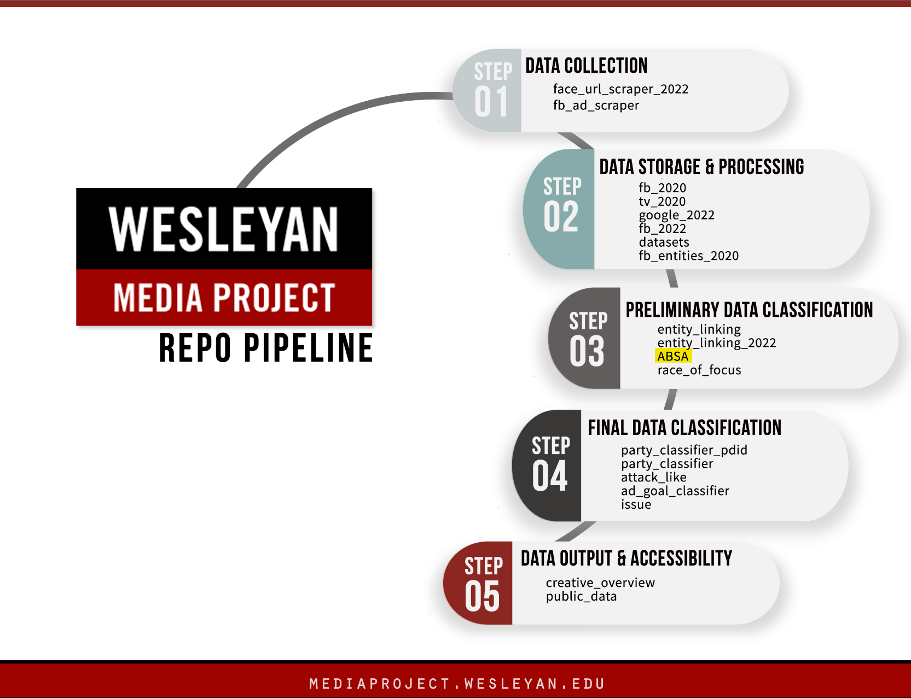

# Wesleyan Media Project - Aspect Based Sentiment Analysis (ABSA)

Welcome! This repo is a part of the Cross-platform Election Advertising Transparency initiative ([CREATIVE](https://www.creativewmp.com/)) project. CREATIVE is a joint infrastructure project of WMP and privacy-tech-lab at Wesleyan University. CREATIVE provides cross-platform integration and standardization of political ads collected from Google and Facebook. You will also need the repo [datasets](https://github.com/Wesleyan-Media-Project/datasets), [fb_2020](https://github.com/Wesleyan-Media-Project/fb_2022) and [entity linking](https://github.com/Wesleyan-Media-Project/entity_linking) repo to run the script.

This repo is a part of the Preliminary Data Classification step.

## Table of Contents

- [Introduction](#introduction)
- [Objective](#objective)
- [Data](#data)
- [Setup](#setup)
  - [Requirements](#requirements)
  - [Training](#training)

## Introduction

This repository contains code for the Aspect-Based Sentiment Analysis (ABSA) to predict sentiment (1: positive, 0: neutral, -1: negative) towards entities identified by the [entity linker](https://github.com/Wesleyan-Media-Project/entity_linking) (see [here](https://github.com/Wesleyan-Media-Project/entity_linking_2022) for the 2022 entity linker). Each identified entity mention has its own ABSA prediction, so that it is (theoretically) possible for an ad to discuss a candidate positively in one place, and negatively in another. The model used in this repo is a random forest. See [here](https://github.com/markusneumann/ABSA-PyTorch) for our repo using a BERT-based model, which is a fork of [this](https://github.com/songyouwei/ABSA-PyTorch) repo (the main difference is that it assumes a binary rather than three-class multinomial model).

## Objective

Each of our repos belongs to one or more of the following categories:

- Data Collection
- Data Storage & Processing
- Preliminary Data Classification
- Final Data Classification

This repo is part of the Preliminary Data Classification section.

## Data

All the data including the ABSA results for the 1.4m dataset  `140m_ABSA_pred.csv.gz` are stored in the `data` folder. They are in `csv.gz` and `csv` format. The training model is stored in the train/models folder in `joblib` format.

## Setup

The scripts are numbered in the order in which they should be run. Scripts that directly depend on one another are ordered sequentially. Scripts with the same number are alternatives; usually they are the same scripts on different data, or with minor variations. The outputs of each script are saved, so it is possible to, for example, only run the inference script, since the model files are already present.

There are separate folders for Facebook and Google. Within Facebook, the code needs to be run in the order of knowledge base, training, and then inference.

For an example pipeline, training on 2020 Facebook, and then doing inference on 2020 Facebook, see `pipeline.sh`. This should take about 20 minutes to run on a laptop.

The scripts `inference/facebook/01_prepare_fb_2022.R` and `inference/google/01_prepare_google_2022.R` require the [entity_linking_2022](https://github.com/Wesleyan-Media-Project/entity_linking_2022) repo.

The script `inference/google/01_prepare_google_2020.R` requires the [entity_linking](https://github.com/Wesleyan-Media-Project/entity_linking) repo.

The script `train/01_prepare_separate_generic_absa.R requires` requires the [entity_linking](https://github.com/Wesleyan-Media-Project/entity_linking) repo, as well as the [datasets](https://github.com/Wesleyan-Media-Project/datasets) repo. It also requires fb_2020_140m_adid_text_clean.csv.gz, which will be accessible through Figma. 

### Requirements

The scripts use both R (4.2.2) and Python (3.9.16). The packages we used are described in requirements_r.txt and requirements_py.txt.

### Training

To train the model to detect sentiment even for entities that aren't seen (or rarely seen) in the training set, the data is set up as following: The specific name of the detected entity is replaced by `$T$` (this is the same way it works in [this](https://github.com/songyouwei/ABSA-PyTorch) repo). This way, the model learns that the output label is based on text that relates to the `$T$`. In theory, a neural-based classifier should be much better at this than a bag-of-words model, but in practice, the latter works well enough. We saw a big difference with a model that only learned and detected sentiment for Trump and Biden - the neural approach was much better here - but for a model targeted at any generic candidate, the bag of words model has results that are comparably good.

